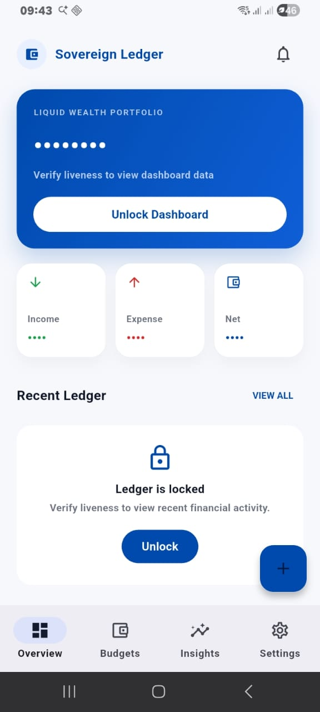
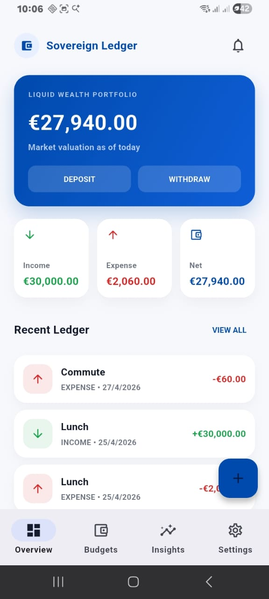
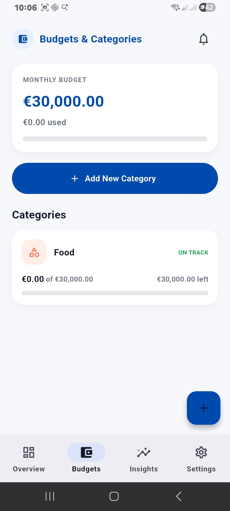
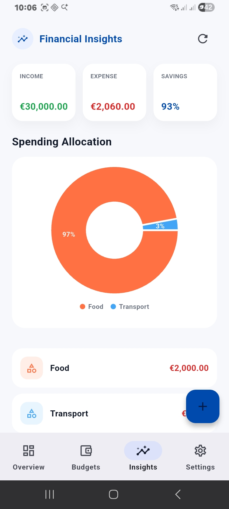
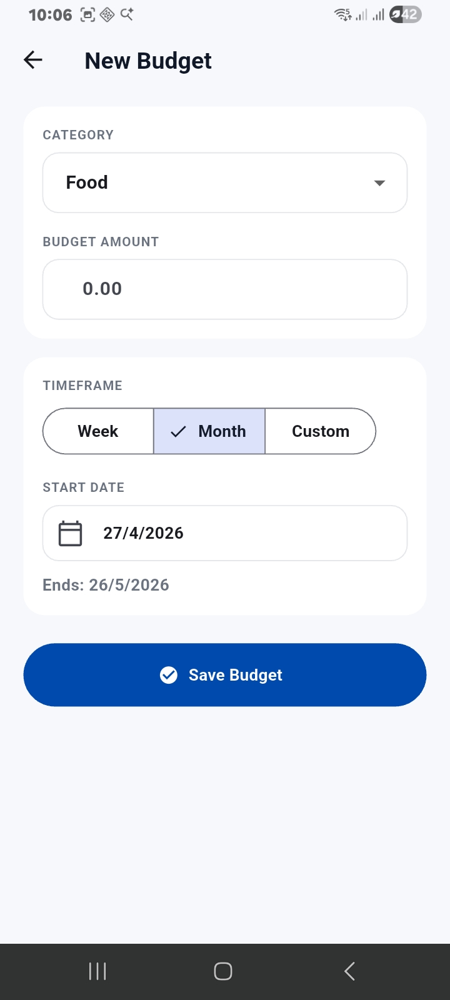
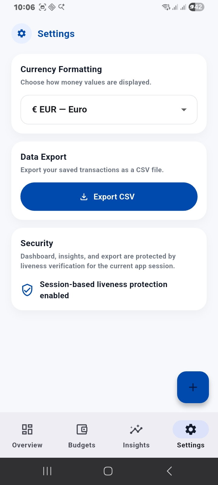
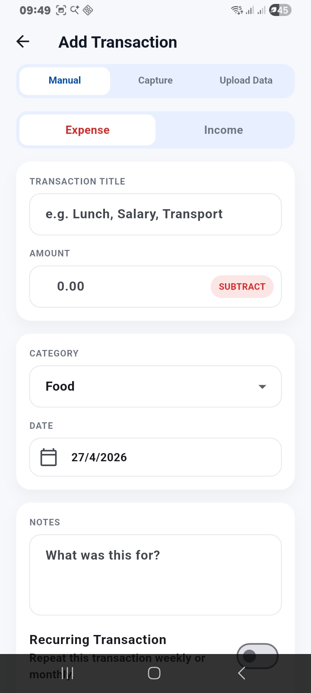

# Sovereign Ledger

## Overview

Sovereign Ledger is a Flutter-based finance tracking mobile application that helps users manage income, expenses, budgets, and financial insights in a structured and secure way.

The app is designed as an offline-first solution, ensuring all data is stored locally while still providing real-time updates and analytics.

Developed as part of the HNG Mobile Track Stage 2 task, the project emphasizes clean architecture, performance, and practical financial workflows.

---

## Features

### Transaction Management

- Add income and expense transactions
- Categorize transactions (Food, Transport, Salary, etc.)
- Input validation to ensure clean and consistent data

### Budgeting System

- Create category-based budgets
- Supports:
  - Weekly budgets
  - Monthly budgets
  - Custom date range budgets
- Tracks spending progress in real time

### Recurring Transactions

- Supports:
  - Weekly recurrence
  - Monthly recurrence
- Automatically generates transactions when due
- Prevents duplicate entries using rule-based logic

### Financial Overview

- Real-time balance calculation
- Income, expense, and net summaries
- Supports and clearly displays negative balances

### Insights Dashboard

- Category-based spending breakdown using pie charts
- Summary financial metrics
- Lightweight legend for chart clarity

### Security: Liveness Verification

- Protects sensitive sections:
  - Dashboard
  - Insights
  - Data export
- Session-based unlock:
  - One successful verification unlocks access
  - Access resets when the app restarts

### Data Persistence

- Fully offline using Hive
- Fast, lightweight local database
- No backend dependency

### Currency Formatting

- Supports:
  - NGN (₦)
  - USD ($)
  - GBP (£)
  - EUR (€)
- Applies selected currency globally across the app

### CSV Export

- Export transactions as CSV
- Share exported file directly through device share options

---

## Architecture

The app follows a modular and scalable architecture.

### State Management

- Provider + Selector pattern
- Minimizes unnecessary UI rebuilds
- Separates UI from business logic

### Data Layer

- Repository pattern for data access
- Hive for local persistence

### Folder Structure

```bash
lib/
├── core/
│   ├── constants/
│   ├── enums/
│   ├── services/
│   └── utils/
├── data/
│   ├── models/
│   └── repositories/
├── features/
│   ├── overview/
│   ├── transactions/
│   ├── budgets/
│   ├── insights/
│   ├── settings/
│   └── security/
├── providers/
└── main.dart
```

---

## Design Approach

The UI was implemented based on a provided Figma design.

Key considerations:

- Clear financial hierarchy
- Clean and minimal layout
- Consistent color system:
  - Income → Green
  - Expense → Red
- High readability and reduced clutter

---

## Security Approach

Liveness verification is applied only to sensitive areas rather than the entire app.

### Rationale

- Reduces friction for everyday usage
- Protects critical financial data
- Improves overall user experience

---

## How to Run

```bash
flutter pub get
flutter run
```

---

## Build APK

```bash
flutter build apk --release
```

---

## APK Preview

https://appetize.io/app/b_2723nptohta2knez32cj2reeda

---

## Screenshots










---

## Challenges

- Handling Hive adapter generation and `build_runner` setup
- Designing a recurring transaction system without background jobs
- Integrating liveness verification with real-world device constraints
- Applying currency formatting consistently across the app
- Handling CSV export across Android storage limitations

---

## Key Learnings

- Structuring scalable Flutter applications
- Managing state efficiently with Provider + Selector
- Designing offline-first applications
- Implementing secure UX without affecting usability
- Translating Figma designs into functional Flutter UI
- Handling local persistence and generated adapters with Hive

---

## Author

Amos Emmanuel - HNG 14 Mobile Development Intern
